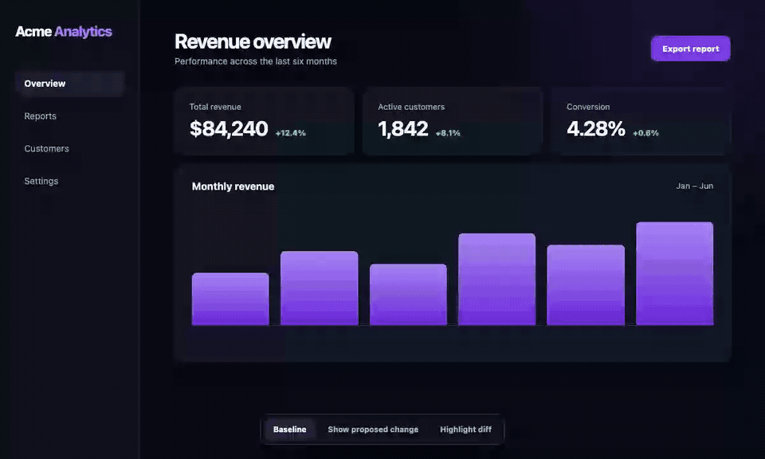
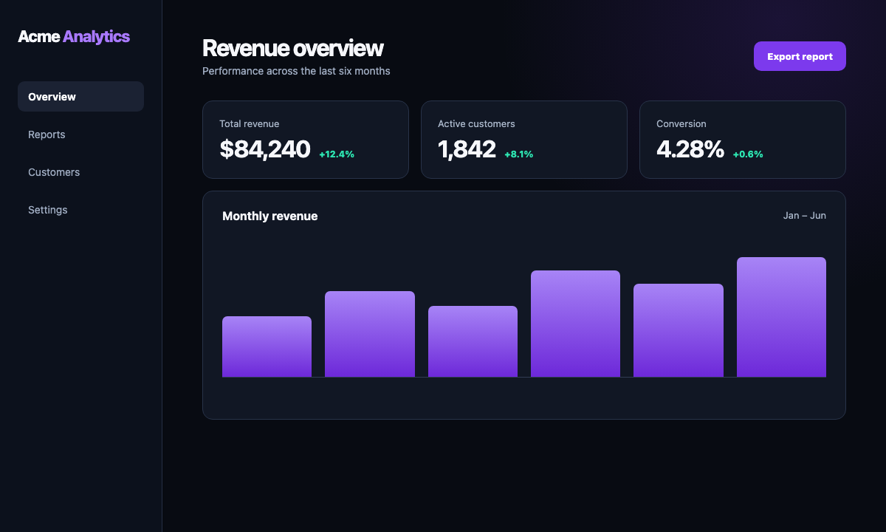
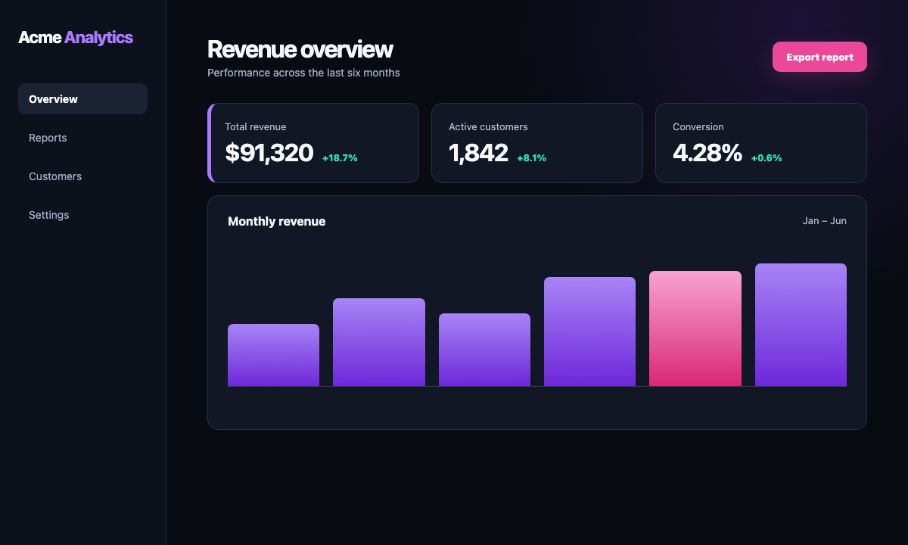
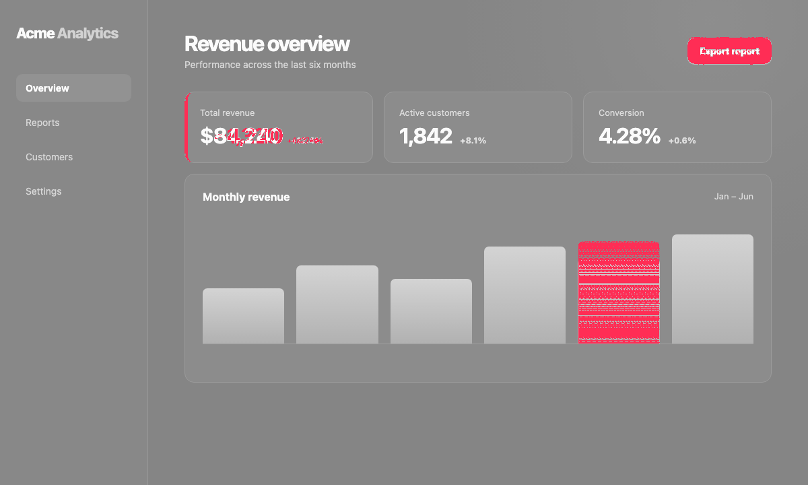

# Glimpse

Glimpse uploads Playwright screenshots and replay videos to S3-compatible storage or Vercel Blob and posts them to a GitHub pull request comment.

It can post either captured screenshots or generated visual diffs. Diff filtering is meant to keep PR comments small: screenshots below a configured change threshold are not uploaded or posted.

## Install

```bash
npm install --save-dev @kernel-labs/glimpse
```

Glimpse expects Node 22 or newer.

## What Reviewers See

Glimpse compares screenshots by relative path, filters changes below your configured threshold, and posts the remaining screenshots or generated diffs to one sticky PR comment.

[](docs/demo/glimpse-demo.mp4)

_Click the preview to open the full demo video. These assets are reproducibly generated from the [example dashboard](examples/demo-app/README.md)._

| Baseline on the target branch | Screenshot from the pull request |
| --- | --- |
|  |  |

With `--diff-mode diffs`, the PR comment shows the generated diff. Changed pixels are highlighted in red; this example has a `2.37%` pixel diff.



## Capture Screenshots

Use the Playwright helpers in tests that should produce PR screenshots.

```typescript
import { test } from '@playwright/test'
import { captureScreenshotWithInfo } from '@kernel-labs/glimpse/playwright'

test('dashboard', async ({ page }, testInfo) => {
  await page.goto('/dashboard')
  await captureScreenshotWithInfo(page, testInfo, 'dashboard')
})
```

By default screenshots are written to `test-results/pr-screenshots`. Set `PR_SCREENSHOTS_DIR` to change that location.

There are two helpers:

- `captureScreenshot(page, options)` writes `name.png`.
- `captureScreenshotWithInfo(page, testInfo, options)` prefixes the filename with the test title, attaches the image to the Playwright report, and uses the test file as the default group in the GitHub comment.

Both helpers accept:

```typescript
{
  name: string
  outputDir?: string
  fullPage?: boolean
  screenshotOptions?: Parameters<Page['screenshot']>[0]
  group?: string
}
```

## Upload Screenshots

Upload captured screenshots after your Playwright run.

S3-compatible storage:

```bash
AWS_REGION=us-east-1 \
S3_BUCKET=my-screenshots \
npx glimpse upload \
  --directory ./test-results/pr-screenshots \
  --storage s3 \
  --pr 123
```

Vercel Blob:

```bash
VERCEL_BLOB_READ_WRITE_TOKEN=vercel_blob_rw_... \
npx glimpse upload \
  --directory ./test-results/pr-screenshots \
  --storage vercel-blob \
  --pr 123
```

The upload command writes `screenshot-urls.json` by default. That JSON is the input for the GitHub comment step.

## Upload Playwright Replays

Enable Playwright video recording, then upload the generated replay videos after the test run. These replays are useful for monitoring what an automated coding agent did during a browser session, not only for reviewing test failures.

Glimpse works with whichever Playwright `video` mode you choose; see Playwright's [video recording documentation](https://playwright.dev/docs/videos) and [`testOptions.video`](https://playwright.dev/docs/api/class-testoptions#test-options-video) for the available options. For agent monitoring, recording the run and reducing the recording dimensions is usually more useful than failure-based retention:

```typescript
import { defineConfig } from '@playwright/test'

export default defineConfig({
  use: {
    video: {
      mode: 'on',
      size: { width: 640, height: 360 },
    },
  },
})
```

Glimpse does not transcode videos in CI. Playwright already emits compressed video files, and lowering the Playwright recording size is usually faster and less bandwidth-heavy than adding a post-test compression step.

```bash
VERCEL_BLOB_READ_WRITE_TOKEN=vercel_blob_rw_... \
npx glimpse upload-replays \
  --directory ./test-results \
  --storage vercel-blob \
  --pr 123 \
  --allow-empty
```

The command recursively uploads `.webm`, `.mp4`, `.mov`, and `.m4v` files and writes `replay-urls.json` by default. Use `--allow-empty` when your Playwright configuration may produce no videos for a run.

## Post a GitHub Comment

Use `postToGitHub` from a GitHub Actions step after upload.

```yaml
permissions:
  contents: read
  issues: write
  pull-requests: read

steps:
  - uses: actions/checkout@v4

  - uses: actions/setup-node@v4
    with:
      node-version: '22.x'

  - run: npm ci
  - run: npx playwright install --with-deps chromium
  - run: npm run build

  - name: Run screenshot tests
    run: npm run test:e2e

  - name: Upload screenshots
    if: always()
    env:
      VERCEL_BLOB_READ_WRITE_TOKEN: ${{ secrets.VERCEL_BLOB_READ_WRITE_TOKEN }}
      PR_NUMBER: ${{ github.event.pull_request.number }}
      RUN_ID: ${{ github.run_id }}
    run: |
      npx glimpse upload \
        --directory ./test-results/pr-screenshots \
        --storage vercel-blob

  - name: Upload replay videos
    if: always()
    env:
      VERCEL_BLOB_READ_WRITE_TOKEN: ${{ secrets.VERCEL_BLOB_READ_WRITE_TOKEN }}
      PR_NUMBER: ${{ github.event.pull_request.number }}
      RUN_ID: ${{ github.run_id }}
    run: |
      npx glimpse upload-replays \
        --directory ./test-results \
        --storage vercel-blob \
        --allow-empty

  - name: Post screenshot comment
    if: always()
    uses: actions/github-script@v7
    with:
      script: |
        const fs = require('fs')
        const { postToGitHub } = await import('${{ github.workspace }}/node_modules/@kernel-labs/glimpse/dist/index.js')

        const screenshots = JSON.parse(fs.readFileSync('screenshot-urls.json', 'utf8'))
        const replays = fs.existsSync('replay-urls.json')
          ? JSON.parse(fs.readFileSync('replay-urls.json', 'utf8'))
          : []

        await postToGitHub({
          screenshots,
          replays,
          prNumber: context.issue.number,
          owner: context.repo.owner,
          repo: context.repo.repo,
          runId: context.runId,
          repositoryUrl: context.payload.repository.html_url,
          token: process.env.GITHUB_TOKEN
        }, github)
```

For S3-compatible storage, replace the upload step environment and storage type:

```yaml
env:
  AWS_REGION: us-east-1
  S3_BUCKET: my-screenshots
  AWS_ACCESS_KEY_ID: ${{ secrets.AWS_ACCESS_KEY_ID }}
  AWS_SECRET_ACCESS_KEY: ${{ secrets.AWS_SECRET_ACCESS_KEY }}
  PR_NUMBER: ${{ github.event.pull_request.number }}
  RUN_ID: ${{ github.run_id }}
run: |
  npx glimpse upload \
    --directory ./test-results/pr-screenshots \
    --storage s3
```

## Diff Against a Local Baseline

Pass a baseline directory to compare current screenshots against previous screenshots with the same relative path.

```bash
npx glimpse upload \
  --directory ./test-results/pr-screenshots \
  --storage s3 \
  --diff-base-directory ./test-results/baseline-screenshots \
  --diff-mode diffs \
  --min-diff-percentage 1
```

Important details:

- Keep `--diff-base-directory` outside `--directory`; Glimpse recursively uploads PNG files from `--directory`.
- `--diff-mode diffs` uploads generated diff images.
- `--diff-mode screenshots` uploads the current screenshot, but only when it differs from the baseline.
- `--min-diff-percentage` controls posting. Pixel diffs below that odiff `diffPercentage` are skipped.
- Layout changes and screenshots with no matching baseline are always included because they are usually high-signal.
- `--odiff-threshold` controls odiff pixel sensitivity. It is not the same as `--min-diff-percentage`.

If every screenshot is below the threshold, `upload` writes an empty JSON array. `postToGitHub` will skip creating a new comment in that case.

## Diff Against the Target Branch

Storage-backed diffs require baseline screenshots to already exist in storage. In CI, those screenshots usually are not in the repository, so you need a separate workflow that runs on the target branch and uploads screenshots for each commit.

The PR workflow then downloads the screenshots for the pull request's base commit and compares the current PR screenshots against them. If this baseline upload workflow is not set up, Glimpse has nothing to diff against and will treat screenshots as new images instead of failing the CI job.

A push workflow for the target branch should upload screenshots using a commit-addressed path:

```bash
VERCEL_BLOB_READ_WRITE_TOKEN=vercel_blob_rw_... \
npx glimpse upload \
  --directory ./test-results/pr-screenshots \
  --storage vercel-blob \
  --path-template 'glimpse-screenshots/commit-{commit}/{relativePath}'
```

On `pull_request` workflows, Glimpse reads `GITHUB_EVENT_PATH` and uses:

- `pull_request.head.sha` for `{commit}` in the current upload path
- `pull_request.base.sha` for `{commit}` in the baseline path
- `pull_request.head.ref` and `pull_request.base.ref` for `{branch}` when needed

Use storage-backed baselines in the PR workflow:

```bash
VERCEL_BLOB_READ_WRITE_TOKEN=vercel_blob_rw_... \
npx glimpse upload \
  --directory ./test-results/pr-screenshots \
  --storage vercel-blob \
  --path-template 'glimpse-screenshots/pr-{pr}/run-{runId}/{relativePath}' \
  --diff-base-from-storage \
  --diff-base-path-template 'glimpse-screenshots/commit-{commit}/{relativePath}' \
  --diff-mode diffs \
  --min-diff-percentage 1
```

This downloads each baseline image from the rendered baseline path, runs odiff locally in CI, and uploads only selected screenshots or generated diff images.

If the target branch has no stored screenshot for a path, Glimpse treats the current screenshot as a new high-signal image and includes it. The same fallback applies when diff mode is enabled without a usable baseline source: Glimpse skips odiff and uploads the current screenshots, marked as missing baselines.

### Complete GitHub Actions Setup

The following workflow publishes commit-addressed baselines on every push to `main`, then uses the pull request's base SHA to find the matching baseline. Replace the build and test commands with the commands used by your project.

```yaml
name: Visual diffs

on:
  push:
    branches: [main]
  pull_request:
    branches: [main]

permissions:
  contents: read
  issues: write
  pull-requests: read

jobs:
  screenshots:
    runs-on: ubuntu-latest
    steps:
      - uses: actions/checkout@v4

      - uses: actions/setup-node@v4
        with:
          node-version: 22
          cache: npm

      - run: npm ci
      - run: npx playwright install --with-deps chromium
      - run: npm run build
      - run: npm run test:e2e

      - name: Publish target-branch baseline
        if: github.event_name == 'push'
        env:
          VERCEL_BLOB_READ_WRITE_TOKEN: ${{ secrets.VERCEL_BLOB_READ_WRITE_TOKEN }}
        run: |
          npx glimpse upload \
            --directory ./test-results/pr-screenshots \
            --storage vercel-blob \
            --path-template 'glimpse-screenshots/commit-{commit}/{relativePath}'

      - name: Generate and upload pull-request diffs
        if: github.event_name == 'pull_request'
        env:
          VERCEL_BLOB_READ_WRITE_TOKEN: ${{ secrets.VERCEL_BLOB_READ_WRITE_TOKEN }}
          PR_NUMBER: ${{ github.event.pull_request.number }}
          RUN_ID: ${{ github.run_id }}
        run: |
          npx glimpse upload \
            --directory ./test-results/pr-screenshots \
            --storage vercel-blob \
            --path-template 'glimpse-screenshots/pr-{pr}/run-{runId}/{relativePath}' \
            --diff-base-from-storage \
            --diff-base-path-template 'glimpse-screenshots/commit-{commit}/{relativePath}' \
            --diff-mode diffs \
            --min-diff-percentage 1

      - name: Post or update the pull-request comment
        if: github.event_name == 'pull_request'
        uses: actions/github-script@v7
        with:
          script: |
            const fs = require('fs')
            const { postToGitHub } = await import(
              '${{ github.workspace }}/node_modules/@kernel-labs/glimpse/dist/index.js'
            )
            const screenshots = JSON.parse(
              fs.readFileSync('screenshot-urls.json', 'utf8')
            )

            await postToGitHub({
              screenshots,
              prNumber: context.issue.number,
              owner: context.repo.owner,
              repo: context.repo.repo,
              runId: context.runId,
              repositoryUrl: context.payload.repository.html_url,
              token: process.env.GITHUB_TOKEN
            }, github)
```

The baseline job must capture the same screenshot paths as the pull-request job. Glimpse matches `chromium/dashboard.png` only with a baseline stored at that same relative path.

### Baseline Lifecycle

- Publish a baseline for every target-branch commit that pull requests can use as a base SHA. A branch-only path such as `main/{relativePath}` can race when `main` advances after a pull request is opened; commit-addressed paths avoid that ambiguity.
- Keep baseline objects at least as long as pull requests can remain open. If storage cleanup removes `commit-{baseSha}`, Glimpse reports those entries as new screenshots instead of generated diffs.
- Run the same browser version, viewport, fonts, locale, timezone, data, and animation-disabling setup in baseline and pull-request jobs. Otherwise environmental drift can create false visual changes.
- Secrets are normally unavailable to workflows from untrusted forks. Choose a storage/authentication policy for forked pull requests before making the visual-diff job required.

### Troubleshooting Visual Diffs

- **Every image says `new screenshot`:** confirm that the baseline workflow ran for the exact pull request base SHA and that `--diff-base-path-template` matches the baseline upload path.
- **Expected images are missing:** Glimpse recursively reads only lowercase `.png` files from `--directory`, and pixel diffs below `--min-diff-percentage` are intentionally omitted.
- **Unrelated areas keep changing:** stabilize the test before lowering the threshold. Freeze clocks and seeded data, wait for fonts and images, disable transitions, and use a fixed viewport.
- **The baseline is never found:** prefer `{relativePath}` over `{filename}` when screenshots are split across browser or test directories. Flattening paths can create collisions.
- **No comment appears:** an empty first result intentionally creates no comment. A later empty result updates an existing Glimpse comment to say that no screenshots or diffs were selected.

## Storage Configuration

S3 environment variables:

- `AWS_REGION` or `S3_REGION`: required
- `S3_BUCKET` or `AWS_BUCKET`: required
- `AWS_ACCESS_KEY_ID`: optional when the default AWS credential chain is available
- `AWS_SECRET_ACCESS_KEY`: optional when the default AWS credential chain is available
- `S3_ENDPOINT`: optional for S3-compatible providers
- `S3_PUBLIC_READ`: set to `false` to avoid public-read ACLs

Vercel Blob environment variables:

- `VERCEL_BLOB_READ_WRITE_TOKEN` or `BLOB_READ_WRITE_TOKEN`: required

Glimpse uploads Vercel Blob artifacts with public access so GitHub can render them in PR comments.

For S3-compatible services:

```bash
S3_ENDPOINT=https://nyc3.digitaloceanspaces.com \
S3_REGION=us-east-1 \
S3_BUCKET=my-screenshots \
npx glimpse upload --directory ./test-results/pr-screenshots --storage s3
```

Artifacts linked from a GitHub comment must be publicly readable. If you set `S3_PUBLIC_READ=false`, serve the bucket through a public CDN or another public URL layer; Glimpse does not generate presigned comment URLs.

## CLI Reference

### `glimpse upload`

```bash
npx glimpse upload --directory <path> --storage <s3|vercel-blob> [options]
```

Options:

- `-d, --directory <path>`: directory containing PNG screenshots
- `-s, --storage <type>`: `s3` or `vercel-blob`
- `-p, --pr <number>`: PR number; can also use `PR_NUMBER`
- `-r, --run-id <id>`: CI run ID; can also use `RUN_ID`
- `--commit <sha>`: commit SHA for path templates; defaults to the pull request head SHA or `GITHUB_SHA`
- `--branch <name>`: branch name for path templates; defaults to the pull request head ref or GitHub branch env vars
- `-t, --path-template <template>`: upload path template; default is `pr-{pr}/run-{runId}/{filename}`
- `-o, --output <path>`: output JSON path; default is `screenshot-urls.json`
- `--diff-base-directory <path>`: baseline screenshot directory
- `--diff-base-from-storage`: download baseline screenshots from storage
- `--diff-base-path-template <template>`: storage path template for baseline screenshots
- `--diff-base-pr <number>`: PR number for baseline path templates
- `--diff-base-run-id <id>`: run ID for baseline path templates
- `--diff-base-commit <sha>`: commit SHA for baseline path templates; defaults to the pull request base SHA
- `--diff-base-branch <name>`: branch name for baseline path templates; defaults to the pull request base ref
- `--diff-mode <screenshots|diffs>`: upload changed screenshots or generated diffs
- `--post-diffs`: shortcut for `--diff-mode diffs`
- `--min-diff-percentage <number>`: skip pixel diffs below this odiff `diffPercentage`
- `--odiff-threshold <number>`: odiff color threshold from `0` to `1`; lower is more sensitive
- `--diff-output-directory <path>`: write generated diff images to a specific directory

Path templates support:

- `{pr}`
- `{runId}`
- `{commit}`
- `{branch}`
- `{filename}`
- `{relativePath}`

Diff options can also be set with:

- `DIFF_BASE_DIRECTORY`
- `DIFF_BASE_FROM_STORAGE=true`
- `DIFF_BASE_PATH_TEMPLATE`
- `DIFF_BASE_PR`
- `DIFF_BASE_RUN_ID`
- `GLIMPSE_DIFF_BASE_COMMIT`
- `GLIMPSE_DIFF_BASE_BRANCH`
- `DIFF_MODE`
- `POST_DIFFS=true`
- `MIN_DIFF_PERCENTAGE`
- `ODIFF_THRESHOLD`
- `DIFF_OUTPUT_DIRECTORY`

### `glimpse upload-replays`

```bash
npx glimpse upload-replays --directory <path> --storage <s3|vercel-blob> [options]
```

Options:

- `-d, --directory <path>`: directory containing Playwright replay videos
- `-s, --storage <type>`: `s3` or `vercel-blob`
- `-p, --pr <number>`: PR number; can also use `PR_NUMBER`
- `-r, --run-id <id>`: CI run ID; can also use `RUN_ID`
- `--commit <sha>`: commit SHA for path templates; defaults to the pull request head SHA or `GITHUB_SHA`
- `--branch <name>`: branch name for path templates; defaults to the pull request head ref or GitHub branch env vars
- `-t, --path-template <template>`: upload path template; default is `pr-{pr}/run-{runId}/replays/{relativePath}`
- `-o, --output <path>`: output JSON path; default is `replay-urls.json`
- `--allow-empty`: write an empty replay URL file instead of failing when no videos are found

### `glimpse generate-comment`

```bash
npx glimpse generate-comment --input screenshot-urls.json --replays-input replay-urls.json [options]
```

Options:

- `-i, --input <path>`: JSON file generated by `glimpse upload`
- `--replays-input <path>`: JSON file generated by `glimpse upload-replays`
- `-p, --pr <number>`: PR number
- `-r, --run-id <id>`: CI run ID
- `--repo-url <url>`: repository URL
- `-o, --output <path>`: output markdown path; default is `pr-comment.md`

## Programmatic API

```typescript
import { uploadReplays, uploadScreenshots, postToGitHub } from '@kernel-labs/glimpse'

const screenshots = await uploadScreenshots({
  directory: 'test-results/pr-screenshots',
  storage: {
    type: 'vercel-blob',
    token: process.env.VERCEL_BLOB_READ_WRITE_TOKEN
  },
  pathTemplate: 'glimpse-screenshots/pr-{pr}/run-{runId}/{relativePath}',
  prNumber: 123,
  runId: process.env.GITHUB_RUN_ID,
  diff: {
    baselineStorage: {
      pathTemplate: 'glimpse-screenshots/commit-{commit}/{relativePath}',
      commitSha: process.env.GITHUB_BASE_SHA
    },
    uploadMode: 'diffs',
    minDiffPercentage: 1
  }
})

const replays = await uploadReplays({
  directory: 'test-results',
  storage: {
    type: 'vercel-blob',
    token: process.env.VERCEL_BLOB_READ_WRITE_TOKEN
  },
  prNumber: 123,
  runId: process.env.GITHUB_RUN_ID,
  allowEmpty: true
})

await postToGitHub({
  screenshots,
  replays,
  prNumber: 123,
  owner: 'owner',
  repo: 'repo',
  token: process.env.GITHUB_TOKEN!,
  runId: process.env.GITHUB_RUN_ID,
  repositoryUrl: 'https://github.com/owner/repo'
}, github)
```

Useful exported types:

- `UploadOptions`
- `ReplayUploadOptions`
- `UploadedScreenshot`
- `UploadedReplay`
- `ScreenshotDiffOptions`
- `ScreenshotBaselineStorageOptions`
- `GitHubCommentOptions`
- `StorageConfig`

## Development

```bash
npm install
npm run build
npm run test
```

## License

MIT
